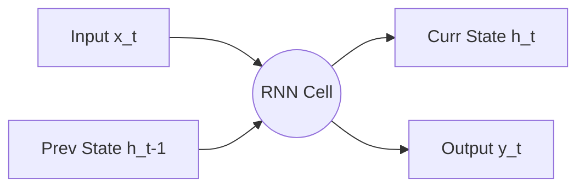

# NLP & Sequence Modeling Concept Notes

This document contains detailed theoretical derivations, equations, and design tradeoffs for sequential architectures, embedding lookups, and recurrent structures.

---

## 🔠 Word Embedding Layers

An embedding layer acts as a parameter lookup table that maps discrete integer indices to dense continuous vector representations.

### Mathematical Formulation
Let $V$ be the vocabulary size and $d$ be the embedding dimension. The embedding weights are parameterized as a matrix:

$$E \in \mathbb{R}^{V \times d}$$

Given an input sequence of token indices $x = [w_1, w_2, \dots, w_T]$, where $w_t \in \{0, 1, \dots, V-1\}$, the lookup for a token $w_t$ can be represented as:

$$e_t = E^T \cdot \text{one\_hot}(w_t) \in \mathbb{R}^d$$

In practice, this is implemented as an $O(1)$ memory lookup rather than a sparse matrix multiplication.

---

## 🔄 Recurrent Neural Networks (RNN)

Vanilla RNNs introduce feedback loops where the output at step $t-1$ is fed back into the hidden state calculation at step $t$.



### Equations
For $t = 1 \dots T$:

$$h_t = \tanh(W_{hh} h_{t-1} + W_{xh} x_t + b_h)$$

$$y_t = W_{hy} h_t + b_y$$

---

## 🛡️ Long Short-Term Memory (LSTM)

LSTMs add an internal cell state $C_t$ that carries long-term memory, governed by three multiplicative gates.

```
                  Cell State (C_t-1) ---------[x]----------------------------(+)----------> Cell State (C_t)
                                               ^                              ^
                                               | (Forget Gate)                | (Input Gate)
                                               |                              |
  Hidden State (h_t-1) ----*---[ Forget Gate ]-*       [ Input Gate ]-*       |
                           |                                          |       |
                           *------------------------------------------[x]------*
                           |                                           ^
                           |                                           | (Candidate)
                           |                                    [ Candidate C~_t ]
                           |
                           *---[ Output Gate ]---*
                                                 |
                                                 v
                                                [x]----------> Hidden State (h_t)
                                                 ^
                                                 |
                                               tanh(C_t)
```

### Mathematical Equations

1. **Forget Gate**: Controls what to discard from the cell state.
   $$f_t = \sigma(W_{f} [h_{t-1}, x_t] + b_f)$$
2. **Input Gate**: Controls what new information to write to the cell state.
   $$i_t = \sigma(W_{i} [h_{t-1}, x_t] + b_i)$$
3. **Candidate Cell State**: The proposed updates.
   $$\tilde{C}_t = \tanh(W_{c} [h_{t-1}, x_t] + b_c)$$
4. **Cell State Update**: Additive combination of historical memory and new proposed memory.
   $$C_t = f_t \odot C_{t-1} + i_t \odot \tilde{C}_t$$
5. **Output Gate**: Controls what parts of the cell state to reveal in the hidden state.
   $$o_t = \sigma(W_{o} [h_{t-1}, x_t] + b_o)$$
6. **Hidden State Update**: Output-gated tanh projection of the cell state.
   $$h_t = o_t \odot \tanh(C_t)$$

---

## ⚡ Gated Recurrent Unit (GRU)

GRUs simplify the LSTM by merging the cell state and hidden state, using only two gates: reset and update.

### Mathematical Equations

1. **Update Gate**: Determines whether to keep the previous hidden state or write the candidate state.
   $$z_t = \sigma(W_{z} [h_{t-1}, x_t] + b_z)$$
2. **Reset Gate**: Controls how much of the past hidden state to forget when calculating the candidate.
   $$r_t = \sigma(W_{r} [h_{t-1}, x_t] + b_r)$$
3. **Candidate Hidden State**:
   $$\tilde{h}_t = \tanh(W_{h} [r_t \odot h_{t-1}, x_t] + b_h)$$
4. **Hidden State Update**: Interpolation between past and current candidate state.
   $$h_t = (1 - z_t) \odot h_{t-1} + z_t \odot \tilde{h}_t$$

---

## ↕️ Advanced Architectures

### 1. Bidirectional RNNs
Processes sequences in both forward and backward directions to capture full context.

$$h_t^{\text{forward}} = \text{RNN}_{\text{forward}}(x_t, h_{t-1}^{\text{forward}})$$

$$h_t^{\text{backward}} = \text{RNN}_{\text{backward}}(x_t, h_{t+1}^{\text{backward}})$$

$$h_t = [h_t^{\text{forward}}; h_t^{\text{backward}}]$$

### 2. Deep Stacked Recurrent Networks
Stacks multiple layers of recurrent cells, where the hidden state $h_t^{(l-1)}$ of layer $l-1$ serves as the input $x_t^{(l)}$ for layer $l$.

```
Layer 2:  h_t-1(2) ---> RNN Cell(2) ---> h_t(2)
                           ^
                           |
Layer 1:  h_t-1(1) ---> RNN Cell(1) ---> h_t(1)
                           ^
                           |
Input:                     x_t
```
- **Tradeoff**: Increases model capacity to learn complex hierarchical abstract features, but significantly increases parameters and computation steps, and worsens training instability (requiring residual connections or dropout).
